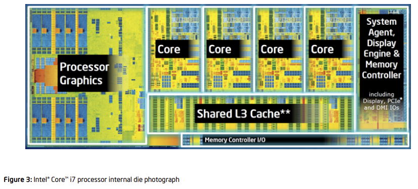
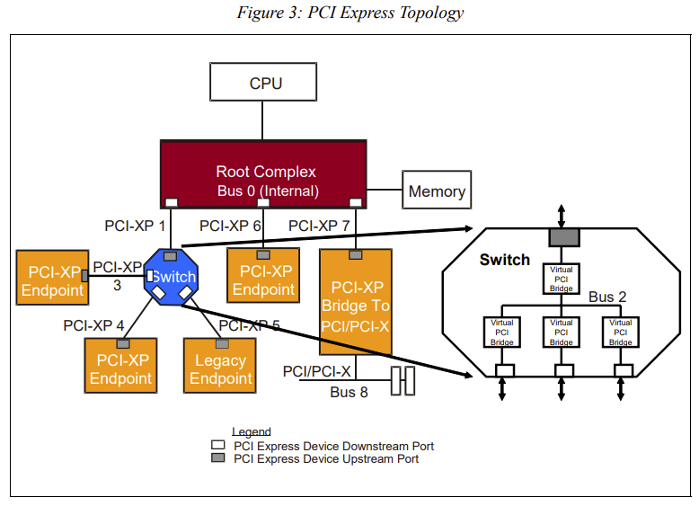

[toc]

## PCIe介绍

PCIe的全称是Peripheral Component Interconnect Express，是一种用于连接外设的总线。它于2003年提出来，作为替代PCI和PCI-X的方案，现在已经成了现代CPU和其他几乎所有外设交互的标准或者基石，比如，我们马上能想到的GPU，网卡，USB控制器，声卡，网卡等等，这些都是通过PCIe总线进行连接的，然后现在非常常见的基于m.2接口的SSD，也是使用NVMe协议，通过PCIe总线进行连接的，除此以外，Thunderbolt 3 [[2\]](https://www.thunderbolttechnology.net/sites/default/files/18-241_Thunder7000Controller_Brief_FIN_HI.pdf)，USB4 [[3\]](https://www.usb.org/document-library/usb4r-specification-v20)，甚至最新的CXL互联协议 [[4\]](https://www.computeexpresslink.org/download-the-specification)，都是基于PCIe的！

## **1. Root Complex (RC)**

Root Complex 是 PCIe 架构的核心组件，负责将 CPU 与 PCIe 总线及其设备连接。它通常集成在现代 CPU 或芯片组内部，并且可以有多个，依赖于处理器的设计和性能需求。例如，高性能的服务器处理器如 AMD 的 EPYC 可以有多个 Root Complex 来管理多个 PCIe 控制器和通道。

## **2.  PCIe 总线**

PCIe 总线使用点对点通信方式，与传统的 PCI 总线的共享式通信方式不同。每个设备或设备组（通过交换机或集线器连接）在 PCIe 中有其独立的通信通道，从而提高数据传输效率和带宽。这种设计使得每个连接都能实现接近其最大理论带宽，不会因其他设备的通信活动而降低性能。

## 3. PCIe设备

PCIe设备通常分为两种类型：

1. **Type 0 设备**：这些是终端设备，直接用于完成特定的功能，如显卡、声卡和网卡。它们直接与用户的应用程序和操作系统交互，提供必要的硬件功能。
2. **Type 1 设备**：包括PCIe Switch和Root Port，功能类似于网络中的交换机。这些设备不直接参与数据处理，而是负责连接和管理其他PCIe设备，优化和路由PCIe总线上的数据通信。

### BDF 地址

BDF（Bus Number, Device Number, Function Number）是PCIe设备在系统中的唯一标识，包括：

- **Bus Number**：8位，最多可以有256条总线。
- **Device Number**：5位，每条总线上可以有最多32个设备。
- **Function Number**：3位，每个设备可以有最多8个功能。

BDF的格式通常表示为 `BB:DD.F`，它允许系统精确地识别和配置每个PCIe设备。

### EP

Endpoint是指连接到PCIe总线上的任何外围设备，它实现了与主机通信的终端接口。这些设备可以是任何类型的终端硬件，如图形卡、网络卡等。每个Endpoint都有自己的功能和资源，可以独立于其他设备操作。在实际应用中，一个单一的物理设备可能包含多个Endpoint，每个Endpoint负责不同的功能。

1. **双网口网卡**：
   - 在这种网卡中，可能有两个独立的网络控制器，每个控制器对应一个PCIe Endpoint。这样设计可以提高数据处理能力和网络流量管理的效率。
2. **显卡**：
   - 显卡可能包含多个Endpoint，每个负责不同的功能：
     - **显卡本身的Endpoint**：处理图形渲染和视频输出。
     - **Audio Endpoint**：处理通过HDMI或DisplayPort传输的音频信号。
     - **USB Endpoint**：如果显卡支持USB-C连接，该Endpoint可能用于处理通过该端口的USB数据。
     - **UCSI Endpoint**：用于管理USB Type-C连接器的配置和通信。

其实就是很简单，将rc看做主，ep就可以视作从，即：cpu通过rc作为主，最终通信的终点是ep

### 补充：rc和ep间如何通信：

1. **数据传输**：当CPU需要与某个PCIe设备交换数据时（例如，向显卡发送图形数据或从网络卡接收数据），CPU通过RC将数据发送到PCIe总线上，数据随后传送到目标EP。
2. **设备控制**：RC可以直接访问连接在PCIe总线上的任何EP的控制接口，进行配置或管理操作。这包括读取设备状态、更改配置参数等。
3. **中断处理**：当EP设备需要CPU注意时（例如，网络卡接收到新的网络包），它可以通过RC向CPU发送中断信号。

### RCIE

**Root Complex Integrated Endpoint (RCIE)** 是PCIe架构中的一个重要概念。RCIE代表那些直接集成到主板或芯片组中、与Root Complex直连的PCIe设备。这类设备通常是系统不可或缺的组件，它们通过与Root Complex的高效直连方式，提供基本的功能性支持给整个系统。

#### RCIE的特点：

1. **无需外部插槽**：与传统需要通过PCIe插槽连接的设备（如独立显卡）不同，RCIE设备是主板上预先集成的，不通过物理PCIe插槽连接。
2. **总线编号为0**：这些设备通常在系统总线架构中的位置非常靠近CPU，因此在系统中的总线编号通常为0，代表与Root Complex的直连。
3. **低延迟和高带宽**：由于RCIE设备直连Root Complex，这种连接方式减少了数据传输路径的长度，相较于通过扩展插槽连接的设备，可以实现更低的延迟和更高的数据传输带宽。
4. **集成在系统中的核心功能**：如内存控制器、集成显卡、网络接口卡、音频处理器等，这些通常是系统运行所必需的核心功能组件。

### Port/Bridge

就是cpu借助rc和多个从ep进行通信，本质上ep是挂载在rc的root port上的。而通信的原理，其实是从一点传到pci bridge，然后多个桥之间传输，最后到rc？

#### 通信流程再探

1. **发起通信**：当CPU需要与某个PCIe设备通信时（读取数据或写入数据），通信请求首先通过Root Complex发起。
2. **通过Root Port**：请求通过相应的Root Port发送，Root Port根据设备的地址路由请求到正确的目的地。
3. **PCIe Bridge的作用**：
   - 如果目标设备位于同一PCIe总线上，则请求直接传达。
   - 如果设备位于不同的PCIe Bus上，请求需要通过一个或多个PCIe Bridges进行路由。这些Bridges负责正确地将数据从一个PCIe Bus转发到另一个PCIe Bus。
4. **到达Endpoint**：最终，请求通过PCIe总线到达目标PCIe设备，也就是Endpoint。设备处理请求后，可能会返回数据或确认信息，这些响应也会通过相同的路径返回到CPU。

**所以，通信其实是这样的，cpu借助rc发起通信，rc首先找到对应设备的port，然后port找到ep的地址，接着借助pcie链路传输。如果链路长，借助多个bridge中转。**

### switch

PCIe Switch在PCIe架构中充当扩展器的角色，允许多个设备通过单一Root Complex连接

原理：

1. **扩展连接**：Switch使得单一的Root Port能够扩展连接多个设备，通过多个Downstream Port实现。
2. **数据路由**：Switch内部的交换电路负责将数据从Upstream Port正确地路由到一个或多个Downstream Ports，以及反向路由，确保数据能够在设备之间正确传输。

每个Switch都有Upstream Port（连接到Root Complex或其他Switch）和多个Downstream Ports（连接到终端设备或其他Switch）。

## 问题

### 1. 什么是pcie点对点通信？

点对点通信？举例来说，现在有pci，其有三条pci线，实际上这三条pci线， 每个pci设备都能使用任意一个pci线。而pcie，有三条pcie线，设备A只能使用pcie1，设备B只能使用pcie2，设备C只能使用pcie3，因为A不能用其它pcie线，因此其无法一对多通信，其要是想跟b通信，只能说a通过pcie1发送到pcie bridge，然后pcie bridge将数据再通过pcie2转发给b

#### PCI 与 PCIe 通信对比

**PCI 通信（共享总线）：**

- 在传统的 PCI 架构中，所有设备共享同一总线。
- 如果设备 A 正在发送数据，其他设备必须等待 A 完成才能开始它们的数据传输。
- 这种共享机制会导致带宽瓶颈，特别是在多设备同时请求数据传输时。

**PCIe 通信（点对点连接）：**

- PCIe 每个设备或设备组都有独立的通信通道（称为链路）。
- 在您的例子中，设备 A、B 和 C 分别通过 PCIe1、PCIe2 和 PCIe3 连接。每个设备都有自己独立的通道，不会与其他设备争用带宽。
- 这种点对点的连接方式减少了数据传输的延迟，提高了效率，因为数据可以直接在源端点和目标端点之间传输，无需经过中心交换机。

#### PCIe 中的数据路由

- 如果设备 A 需要与设备 B 通信，数据将从 A 通过其 PCIe 链路发送到一个中心化的 PCIe 交换机（如果存在的话），然后交换机会将数据路由到设备 B 的 PCIe 链路。
- 这种方式虽然涉及到中转，但由于每个链路的高带宽和低延迟，整体通信效率仍然非常高。
- 此外，PCIe 设备间的通信通常通过内核管理的驱动和硬件层的优化来进一步提升性能。

### 2. PCI中总线是否被视为一个整体？

我的关键问题是pci1-3被共同视作一个pci总线的整体？还是说他们分别都可以进行总线的仲裁

在传统的 PCI 架构中，如果说到“PCI1-3”这样的表达，通常是指单个 PCI 总线上的不同插槽或设备端口。这些端口或插槽共享同一组总线线路，因此它们实际上是连接到同一总线上的。这意味着

### 3.cpu为什么要借助RC和pcie外设相连接啊？

这不合理啊。cpu不是操作dma控制器，然后dma控制器和pcie外设连接吗？

RC 的存在是因为需要一个专门的硬件来处理 CPU 和 PCIe 设备之间的复杂交互，包括数据路由、电源管理和数据传输协议等。而 DMA 控制器的使用则是为了提高数据传输的效率和减轻 CPU 负载。这两者在现代计算机架构中各司其职，共同提高系统的性能和效率。

1. **CPU 和 RC**：CPU 不直接与 PCIe 外设通信，而是通过 RC。RC 负责解析 CPU 的命令和访问请求，然后将这些请求转发到正确的 PCIe 设备。

2. **数据传输**：在进行大量数据传输（如从存储设备到内存的数据传输）时，通常会使用 DMA。CPU 发出指令配置 DMA 传输，DMA 控制器处理具体的数据传输过程。

还是没解答我的疑问，我的疑问是：cpu根本不用和pcie外设相连接，pcie外设应该和dma控制器连接，rc应该集成在dma控制器中。

所以，其实是因为cpu对pcie外设的访问不只是dma方式，还有普通的读方式

